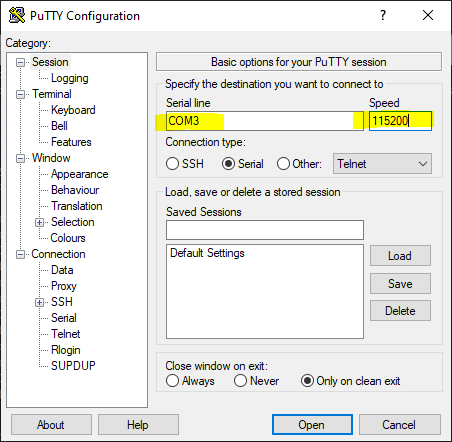

<p align="center">
  <a href="http://nipoanz.com/" target="blank"></a>
</p>

# Micropython config with Esp32 y Esp8266 Project

Este proyecto está diseñado para configurar de manera rápida y sencilla un ESP32 o ESP8266 con MicroPython.

## Requisitos

- Python 3
- `esptool` para flashear el firmware de MicroPython
- Firmware de MicroPython para ESP32

## Instalar

1. Clonar el repositorio:
    ```sh
    git clone https://github.com/usuario/mi_proyecto.git
    cd mi_proyecto
    ```

2. Crear y activar el entorno virtual:
    ```sh
    python -m venv env
    # En Windows
    .\env\Scripts\activate
    # En macOS y Linux
    source env/bin/activate
    ```

3. Instalar dependencias:
    ```sh
    pip install -r requirements.txt
    ```


## Detectar Puertos

Para detectar los puertos disponibles en el sistema, se puede ejecutar el siguiente comando:

```sh
py ./tools/ports.py
```

Al ejecutar el comando, se mostrará una lista con los puertos disponibles en el sistema. Esto se hace utilizando la libreria `pyserial` de Python.

Ejemplo de salida:

```
Puertos disponibles:
COM3: Silicon Labs CP210x USB to UART Bridge (COM3)
```

## Descargar Firmware

Para descargar el firmware de MicroPython visitar el siguiente enlace oficial de [Micropython](https://micropython.org/download/?port=esp32), para este proyecto nos enfocaremos en el ESP32 con la versión WROOM.

<br>
<p align="center" >
  <a href="http://nipoanz.com/" target="blank">
  
  </a>
</p>
<br>

Y para para el ESP8266 visitar el siguiente enlace oficial de [Micropython](https://micropython.org/download/?port=esp8266), para este proyecto nos enfocaremos en el ESP8266 con la versión `esp8266-20240602-v1.23.0.bin`.

<br>
<p align="center">
  <a href="http://nipoanz.com/" target="blank"></a>
</p>
<br>


> En este proyecto descargamos el  Firmware más reciente hasta la fecha de este tutorial `12/08/2024`, por lo cual se descargó el archivo `esp32-idf4-20200812-v1.12.bin`,  y este se encuentra ubicado en la carpeta `firmware` del proyecto. 


## Borrar Memoria Flash

Para borrar la memoria flash del ESP32 o ESP8266, se puede ejecutar el siguiente comando:

```sh
py ./tools/erase_flash.py
```

> No hay necesidad de indicar el puerto dado que el script detecta automáticamente los puertos disponibles en el sistema, ni el tipo de board Esp32 o Esp8266, pero solo se puede conectar estos dos tipos de board y que esté conectado al puerto USB de la computadora.

Puede que al ejecutar el comando, no se limpie la memoria flash de la Board automaticamente, por lo que puede aparecer un mensaje de conección como:

```sh
Connecting...................
```

Por lo que deberá presionar el botón de `BOOT` del Esp32 o de la Esp8266 para que se limpie la memoria flash.	
 
<br>
<p align="center">
  <a href="http://nipoanz.com/" target="blank"></a>
</p>
<br>

 > El mensaje anterior indica que su EPS32 esta no está en modo `Flash`


## Flashear Firmware

Para flashear el firmware de MicroPython de la board, se puede ejecutar el siguiente comando:

```sh
py ./tools/flash.py  [--erase]
```

Ejemplo:

```sh
py ./tools/flash.py --erase
```

> `--erase` es un argumento opcional que se puede utilizar para borrar la memoria flash antes de flashear el firmware.

**Nota:** Recuerde que el firmware de MicroPython debe estar en la carpeta `firmware` del proyecto y para este proyecto se descargó el archivo `ESP32_GENERIC-20240602-v1.23.0.bin`. Y si necesita otra versión del firmware, puede descargarlo del siguiente enlace [Micropython](https://micropython.org/download/ESP32_GENERIC/).


> No hay necesidad de indicar el puerto dado que el script detecta automáticamente los puertos disponibles en el sistema. Pero si es necesario que el Esp32/Esp8266 esté conectado al puerto USB de la computadora. Además puede que la Esp32/Esp8266 no este en modo `Flash`, por lo que deberá presionar el botón de `BOOT` del Esp32/Esp8266 para que se limpie la memoria flash.

## RELP

Para conectarse al REPL del Esp32/Esp8266, se connecta por medio de `PUTTY`debido a que este proyecto se ejecuta en un sistema operativo Windows. Debe validar el puerto en el que se encuentra conectado el Esp32/Esp8266, y luego si hacer una conexión serial con el puerto y una velocidad de 115200 baudios.

**Detectar Puertos**
<p align="center">
  <a href="http://nipoanz.com/" target="blank"></a>
</p>
<br>

**Conexión Serial con Putty**
<p align="center">
  <a href="http://nipoanz.com/" target="blank"></a>
</p>
<br>

**Ejemplo de Conexión**
<p align="center">
  <a href="http://nipoanz.com/" target="blank"></a>
</p>
<br>

**Dispositivo**
<p align="center">
  <a href="http://nipoanz.com/" target="blank"></a>
</p>
<br>

> Vea este video para más información [Video](https://www.youtube.com/watch?v=ws08aYb6EPI&t=241s&ab_channel=RealPython) del Canal de Youtube de RealPython.

## Ampy

Para transferir archivos al Esp32/Esp8266, se puede utilizar `ampy`. Para instalar `ampy`, [documentación](https://learn.adafruit.com/micropython-basics-load-files-and-run-code/install-ampy), para este proyecto se instala con el siguiente comando:

```sh
pip install adafruit-ampy
```

### Transferir Archivos
Para transferir un archivo al Esp32/Esp8266, se puede ejecutar el siguiente comando:

```sh
 ampy --port <puerto> --baud <velocidad> --delay <tiempo-en-segundos>   put  <archivo-origen> <archivo-destino>
```

Ejemplo 
```sh
ampy --port COM3 --baud 115200 --delay 0.5 put .\scripts\main.py  /main.py
```
### Ejectuar Archivos en el Esp32/Esp8266

Para ejecutar un archivo en el Esp32/Esp8266, se puede ejecutar el siguiente comando:

```sh
 ampy --port <puerto> --baud <velocidad> --delay <tiempo-en-segundos> run  --no-output <archivo>
```

> El argumento `--no-output` se utiliza para ejecutar el archivo en la Esp32/Esp8266

### Listar Archivos en el Esp32/Esp8266

Para listar los archivos en el Esp32/Esp8266, se puede ejecutar el siguiente comando:

```sh
 ampy --port <puerto> --baud <velocidad> --delay <tiempo-en-segundos> ls
```

### Eliminar Archivos en el Esp32/Esp8266

Para eliminar un archivo en el Esp32/Esp8266, se puede ejecutar el siguiente comando:

```sh
 ampy --port <puerto> --baud <velocidad> --delay <tiempo-en-segundos> rm <archivo>
```


### Obtener contenido de un archivo en el Esp32/Esp8266

Para obtener el contenido de un archivo en el Esp32/Esp8266, se puede ejecutar el siguiente comando:

```sh
 ampy --port <puerto> --baud <velocidad> --delay <tiempo-en-segundos> get <archivo>
```

### Crear Directorio en el Esp32/Esp8266

Para crear un directorio en el Esp32/Esp8266, se puede ejecutar el siguiente comando:

```sh
 ampy --port <puerto> --baud <velocidad> --delay <tiempo-en-segundos> mkdir <directorio>
```


### Copiar Directorio en el Esp32/Esp8266

Para copiar un directorio en el Esp32/Esp8266, se puede ejecutar el siguiente comando:

```sh
 ampy --port <puerto> --baud <velocidad> --delay <tiempo-en-segundos> put adafruit_driver <directorio>
```


> Para obtener más información sobre `ampy` puede visitar la documentación oficial en el siguiente enlace [Documentación](https://cdn-learn.adafruit.com/downloads/pdf/micropython-basics-load-files-and-run-code.pdf).


## Simulación Circuitos

Puede hacer simulaciones de circuitos con el Esp32/Esp8266 en la plataforma de [WORKI](https://wokwi.com/projects/359801682833812481).


## Tutorial

Puede guiarse con el siguiente tutorial para configurar su Esp32/Esp8266 con MicroPython [Tutorial](https://www.youtube.com/watch?v=ck5PTWplKIc&ab_channel=Sam) del Canal de Youtube de Sam.

## Documentación Micropython

Puede ver la documentación oficial de MicroPython en el siguiente enlace [Documentación](https://github.com/micropython/micropython).

## Contribuir

1. Hacer un fork del repositorio.
2. Crear una nueva rama (`git checkout -b feature-nueva-funcionalidad`).
3. Hacer commit de los cambios (`git commit -am 'Agregar nueva funcionalidad'`).
4. Hacer push a la rama (`git push origin feature-nueva-funcionalidad`).
5. Crear un Pull Request.

## Licencia

Este proyecto está bajo la Licencia MIT.
